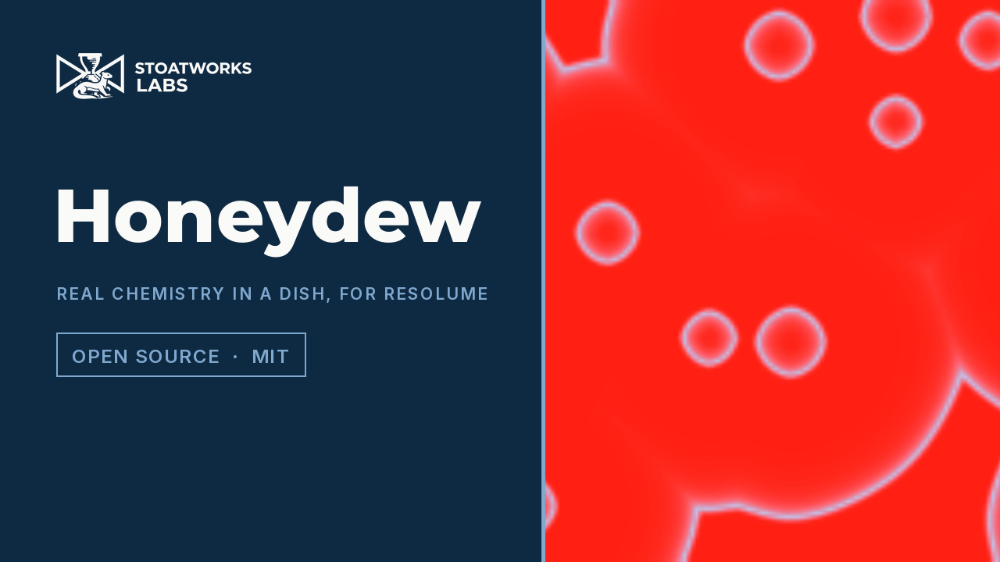

# honeydew

> **AI-assisted project.** This codebase was created with [Claude](https://claude.com/claude-code)
> (Anthropic), directed and reviewed by a human author. It has **never been loaded into
> Resolume on macOS**; there the bundles are read and driven by [oxbow](https://github.com/stoatworks-labs/oxbow),
> a real FFGL host that is not Resolume. On Windows both plugins pass the fleet's Arena gate in
> Resolume Arena 7.27.1 on software rendering (see [Status](#status)). Everything below is measured by an offline
> harness that drives the real plugin classes in a headless GL context on a synthetic
> clock, on this Mac's GPU at two rasters, and reads the chemistry back out of the
> plugin's own state and pixels. The chemistry is not asserted but held to its own
> literature: `hdtest --oregonator` reads a stirred ferroin dish's period from the
> pixels and gets **101.19 s against 100.97 s** from the three-variable Oregonator in
> double; `--fieldnoyes` reads a trigger wave's speed and gets **0.1017 mm/s against
> 0.1008** from the 1-D double solution of the same PDE at three acids (in the excitable
> setting f = 2.6, Excitability 0.69); `--clock` reads
> the iodine clock's snap and gets **25.25 s against the Harcourt–Esson closed form's
> 25.01**; `--briggs` reads eleven batch Briggs–Rauscher oscillations, whose gaps lengthen
> from about 130 s to 640 s as the batch runs down, and gets a **mean period of 248.00 s
> against 248.04** from the De Kepper–Epstein mechanism in double; `--turing` reads the CDIMA pattern's
> wavelength off an FFT of the state and gets **0.1220 mm against the Lengyel–Epstein
> model's 0.1205**. The colour is never a palette: `--beer` holds every pixel of a
> uniform dish to a double-precision Beer–Lambert integral through the CIE 1931 observer
> within **2×10⁻⁷**. `--negative` re-runs twenty checks against deliberately wrong
> models, and `tools/mutate.sh` changes one character of the shipped shaders and code;
> every one is caught. A control sweep fails if any parameter does nothing. **The
> chemoconvection cells of the spec's third change are not built**: see Status.

Oscillating and clock reactions in a Petri dish on a lightbox, for Resolume
Arena/Avenue, as two FFGL plugins: **SW Honeydew**, a source that is the dish on its
lightbox, and **SW Honeydew Over**, an effect whose clip is the lightbox, filtered by the
chemistry and, where the chemistry is photosensitive, acting on it.

The source's defaults after 900 chemical seconds (30 s at Time-lapse 30×): a 60 mm
wide ferroin BZ layer in Flow, pacemakers firing target waves that annihilate where
they meet. Rendered by the plugin's offline harness (`hdtest`), not captured from
Resolume.

<!-- downloads:start -->

## Download

**[v0.1.0](https://github.com/stoatworks-labs/honeydew/releases/tag/v0.1.0)** — prebuilt for macOS and Windows. Pick your platform:

<b>macOS</b> — Universal (Apple Silicon + Intel)

| Build | Download | Size |
| --- | --- | --- |
| Universal (Apple Silicon + Intel) · .dmg disk image | [`honeydew-0.1.0-macos-universal.dmg`](https://github.com/stoatworks-labs/honeydew/releases/download/v0.1.0/honeydew-0.1.0-macos-universal.dmg) | 642 KB |
| Universal (Apple Silicon + Intel) · .zip archive | [`honeydew-macos-universal.zip`](https://github.com/stoatworks-labs/honeydew/releases/latest/download/honeydew-macos-universal.zip) | 572 KB |

<b>Windows</b> — x64

| Build | Download | Size |
| --- | --- | --- |
| x64 · .exe installer | [`honeydew-0.1.0-windows-x86_64-setup.exe`](https://github.com/stoatworks-labs/honeydew/releases/download/v0.1.0/honeydew-0.1.0-windows-x86_64-setup.exe) | 274 KB |
| x64 · .zip archive | [`honeydew-windows-x86_64.zip`](https://github.com/stoatworks-labs/honeydew/releases/latest/download/honeydew-windows-x86_64.zip) | 317 KB |

All builds, checksums and release notes: [github.com/stoatworks-labs/honeydew/releases](https://github.com/stoatworks-labs/honeydew/releases).

macOS builds are signed and notarised and open normally. The Windows builds are unsigned, so SmartScreen warns once.

<!-- downloads:end -->

## Video

*[Watch it](https://www.youtube.com/watch?v=EbBfD06QFAs) — 88 seconds: ferroin target waves,
a stirred dish flipping red–blue–red, CDIMA Turing spots, the traffic light shaken back, the
chameleon's rings and a drop on every audio onset, then the Over on Resolume's demo clips:
a BZ filter, the iodine clock snapping on the bar, Briggs–Rauscher, the blue bottle and a
Ru(bpy)₃ dish under Light Coupling. Every frame is the real plugin's output, rendered by its
offline harness through `hdtest --pipe`, not captured from Resolume.*

## The one idea

**A thin layer of real reagents in a dish on a lightbox.** Every reaction is a published
mechanism with its rate constants in mol/L and seconds; the species diffuse with real
diffusion coefficients across a dish whose width is in millimetres; and the colour is
**never a palette**. Each coloured species has a molar absorption spectrum ε(λ); the
layer's transmittance is Beer–Lambert, T(λ) = 10^(−Σ εᵢ(λ)cᵢℓ), through the layer's
Depth; the picture is the lightbox's spectrum through T(λ), integrated against the CIE
1931 2° observer and taken to sRGB. The red of ferroin and the blue of ferriin, the
amber of iodine and triiodide, the blue-black of the starch–iodine complex, the grey of
permanganate seen through manganate, all fall out of concentrations.

Eight reactions (the **Reaction** option), and what falls out of each:

1. **Belousov–Zhabotinsky.** The Field–Körös–Noyes mechanism as the three-variable
   Oregonator, integrated per cell with a stiff second-order step, with the constants
   computed from the recipe. **Ferroin** (red ⇄ blue), **Ru(bpy)₃** (orange ⇄ pale
   green, and photosensitive) or **Cerium** (colourless ⇄ yellow). Target waves from
   pacemakers; waves that annihilate where they meet; and, stirred, the whole dish
   flipping red–blue–red in unison. **Excitability** is the Oregonator's stoichiometric
   factor f: at the default (f = 1.4) the dish oscillates in bulk and a cut wave is
   overrun; past the model's own boundary (f = 1.78 at the 1× recipe, the slider's 0.42;
   the textbook 1 + √2 is the two-variable model's) the layer is excitable and quiet until
   a Drop, and **Break Wave winds a pair of spirals** that turn for ever.
   Under Ru(bpy)₃ the Over's clip is light that makes bromide: a lit region is inhibited
   and waves stop at its edge.
2. **Briggs–Rauscher.** Iodate, hydrogen peroxide, malonic acid, Mn²⁺, acid and starch,
   stirred: **colourless → amber → blue-black** and round again; in Batch it runs down
   after some minutes. The De Kepper–Epstein mechanism, ten species in double on the CPU.
   Stirred only in this version.
3. **Iodine clock.** Harcourt–Esson: peroxide oxidises iodide slowly, thiosulfate turns
   the iodine straight back, and when the thiosulfate is gone the starch snaps the layer
   **colourless → blue-black**. A clock, not an oscillator, so the cycle is **dosing**: a
   Drop of thiosulfate clears it and it runs again. **Clock Sync** sizes each dose from the
   closed form so the snap lands on the next beat or bar.
4. **CDIMA Turing.** Chlorine dioxide–iodine–malonic acid with starch, as the
   Lengyel–Epstein model: **stationary spots and stripes** at a wavelength set by the
   chemistry (0.12 mm at the recipe: a 10 mm dish, or Detail 1024), not by the dish;
   light suppresses it, so a picture through the Over prints into it.
5. **Traffic Light.** Indigo carmine, glucose and sodium hydroxide: standing, **green →
   red → yellow** (oxidised, the one-electron red, the leuco form); a **Shake** brings air
   in and runs it back. The green is a blue/yellow acid–base pair that moves with the
   base: ¼× base reads blue, 4× reads yellow. In Batch the glucose is spent and each
   cycle is longer than the last.
6. **Blue Bottle.** The same engine with methylene blue on Pons et al. 2000's rate law:
   shaken, blue; standing, colourless.
7. **Vanishing Valentine.** The same engine with resazurin: the first reduction to pink
   resorufin is **irreversible**, so the first shake's blue never comes back; after it,
   pink ⇄ colourless with every shake.
8. **Chemical Chameleon.** Permanganate reduced by glucose in alkali: **purple → green →
   yellow-brown**, Mn(VII) → Mn(VI) → colloidal MnO₂; a dose turns it purple again, in
   Batch the colloid accumulates dose by dose, Flow washes it out, and a drop in a still
   layer spreads into rings in that order. The blue the demonstration shows **does not
   fall out** of permanganate plus manganate through these spectra (it reads grey:
   AGENTS.md), so this plugin's sequence has no blue.

In **SW Honeydew Over** the clip is the lightbox. The layer is a per-pixel 3×3 filter on
the clip (exactly the identity for an empty dish), and **Light Coupling** lets the
clip's brightness act on the photosensitive chemistries: Ru(bpy)₃ BZ and CDIMA. **Seed
From Clip** excites the dish where the clip is bright.

SW Honeydew Over on the harness's test card after 300 chemical seconds. Rendered by
`hdtest`.

## Controls

- **Reaction:** Reaction (*Belousov–Zhabotinsky*, *Briggs–Rauscher*, *Iodine Clock*,
  *CDIMA Turing*, *Traffic Light*, *Blue Bottle*, *Vanishing Valentine*, *Chemical
  Chameleon*), Catalyst (*Ferroin*, *Ru(bpy)3*, *Cerium*; BZ only), Reactor (*Batch*: the
  reagents run down; *Flow*: a stirred-tank feed at the recipe, residence 300 s), Reset
  (a fresh dish), Seed (the pacemakers and the drops' positions), Excitability (BZ only,
  new in 0.1.1: the Oregonator's f from 1 to 4; 1.4 at the default oscillates, past 1.78
  at the 1× recipe the layer is excitable and Break Wave makes spirals).
- **Recipe:** Oxidant, Acid or Base, Reductant, Indicator — each a log multiplier (¼× to
  4×, 0 at the bottom for none) of the reaction's cited recipe, below.
- **Vessel:** Vessel (*Full Frame*: the layer fills the picture; *Petri Dish*: a round
  dish with no-flux walls), Dish Width (10–300 mm: the picture's width), Depth (0.3–20 mm: the colour's path length), Stir (a bar's vortex and eddies; past
  0.6 the whole vessel mixes), Time-lapse (1–300× real time), Detail (128, 256, 512 or
  1024 cells across).
- **Drops:** Drop (the reaction's own dose: catalyst, thiosulfate, air, permanganate),
  Drop Size (1–20 mm), Drop Position (*Random*, *Centre*; the Over adds *Brightest*:
  where the clip is brightest), Break Wave (a pipette drawn through the waves: with
  Excitability in the excitable regime, a pair of spirals), Shake (air into the dish, with a burst of stirring), Auto Drop (0 or
  1–60 a minute: the reaction's own drop, by itself),
  Audio (Resolume's FFT buffer), Audio Drops, Audio Shakes (a drop or a shake per onset).
- **Clock:** Clock Sync (*Off*, *Beat*, *Bar*): the clock's thiosulfate, the blue-bottle
  family's air and the chameleon's permanganate are sized or timed so the snap, the fade
  or the green lands on the next beat or bar.
- **Light:** Lightbox (*Daylight D65*, *LED 5000K*, *Warm White*; the source only: the
  Over's light is its clip), Exposure (±2 stops); the Over adds Light Coupling (how much
  of the clip's brightness the photosensitive chemistries see), Seed From Clip and Mix.

The 1× recipe each slider multiplies:

| reaction | Oxidant | Acid or Base | Reductant | Indicator |
| --- | --- | --- | --- | --- |
| Belousov–Zhabotinsky | NaBrO₃ 0.3 M | H⁺ 0.3 M | malonic acid 0.1 M | catalyst 1.0 mM |
| Briggs–Rauscher | KIO₃ 0.067 M (H₂O₂ 1.3 M follows it) | H⁺ 0.08 M | malonic acid 0.05 M; Mn²⁺ 0.02 M fixed | starch 5×10⁻⁴ M of sites |
| Iodine clock | H₂O₂ 0.1 M | H⁺ 0.05 M | Na₂S₂O₃ 5 mM; KI 0.05 M fixed | starch 5×10⁻⁴ M of sites |
| CDIMA Turing | ClO₂ 2.0 mM | H⁺ 1.0 mM | malonic acid 3.5 mM | starch/PVA 1.5 mM of sites |
| Traffic light | O₂ 2.6×10⁻⁴ M (air saturation: what a Shake delivers) | NaOH 0.08 M | glucose 0.054 M | indigo carmine 2×10⁻⁴ M |
| Blue bottle | O₂ 2.6×10⁻⁴ M | NaOH 0.08 M | glucose 0.054 M | methylene blue 4.6×10⁻⁵ M |
| Vanishing valentine | O₂ 2.6×10⁻⁴ M | NaOH 0.08 M | glucose 0.054 M | resazurin 3×10⁻⁵ M |
| Chemical chameleon | KMnO₄ 1.3 mM per dose | NaOH 0.25 M | glucose 0.05 M | KMnO₄ 1.3 mM in the dish at the start |

Every constant, and which are stand-ins, is in [docs/CHEMISTRY.md](docs/CHEMISTRY.md).
The source is opaque (the lightbox is the picture); the Over keeps the clip's alpha.

## Status

**v0.1.1, 4 October 2026, and honestly early.** 0.1.1 adds the Excitability control, so
Break Wave's spirals are reachable (the slider past 0.42, a Drop, then the button), and a
fresh dish stirred hard now starts on its own; a 0.1.0 composition looks the same. There is a
[user guide](https://stoatworks-labs.com/software/honeydew/guide/)
([PDF](docs/USER-GUIDE.pdf)), a [project page](https://stoatworks-labs.com/software/honeydew/)
and a [browser demo](https://honeydew-demo.stoatworks-labs.com/) (below); no OpenFX port.

It has **never been loaded into Resolume on macOS**. `oxbow probe` reads the bundles
as a host does (`SW Honeydew` / `HD01` / source, `SW Honeydew Over` / `HD02` / effect)
and `oxbow selftest` renders 120 frames through each. Built and measured on macOS
(Apple Silicon). The macOS build is Developer ID-signed and notarised.

### In Resolume Arena, on Windows

On Windows both plugins have been loaded: the DLLs release.yml built from the tagged tree
load, register and render in Resolume Arena 7.27.1 on software rendering (win-lab, Mesa
llvmpipe, no GPU, no sound device), with every control matching what the plugins declare
(32 and 35 host controls, Arena's own Opacity included), Arena's log clean and Arena alive
at the end, in the fleet's Arena gate: 15 of 15 checks, the audio rows skipped. On the
source 12 controls were confirmed live one at a time (Reaction, Catalyst, Oxidant,
Reductant, Indicator, Vessel, Depth, Time-lapse, Drop Size, Clock Sync, Lightbox,
Exposure) and 8 read inconclusive, none dead: the dish's waves move every frame, so no two
grabs of the picture are alike and the gate's noise floor is high. On the Over 21 were
confirmed live, Drop Position inconclusive and Seed From Clip inert (it acts only on a
Reset, which the gate never presses). The harness's own sweep (all 54 parameters move the
picture) carries the rest. Software rendering says nothing about a GPU or about speed.

**Not built: the chemoconvection cells.** The spec's third change asked for a
depth-resolved Boussinesq solver (a Convection control, `--rayleigh`,
`--chemoconvection`) for the blue-bottle family in a still layer. It was triaged last,
after the two-dimensional set, and it is not in this version: no solver, no checks, and
no Convection control is declared, because a control that does nothing fails the sweep
and lies. A still layer takes oxygen through its surface by a stated closure instead
(AGENTS.md).

What is measured, on this machine, at 1280x720 and 320x180 on the GPU (the chemical
numbers are the same at both rasters, to the digit printed):

| | |
| --- | --- |
| the light | 20 species reproduce their cited λmax and ε_max (11 of the peaks stand-ins, named); 20 cited solutions land in their named hues; D65 through an empty dish is sRGB white within 2×10⁻³ |
| Beer–Lambert | a uniform dish's pixels within 1.9×10⁻⁷ of the double integral at 1.5 mm and 1.3×10⁻⁷ at 3 mm (the per-channel square would be off by 0.315); an empty dish returns the lightbox within 1.5×10⁻⁷ and the Over returns its clip to the float |
| the Over | Mix 0 returns the clip bit for bit; with Light Coupling 0, 80 s of a Ru-BZ wave on the card and on black agree in every state float (0 differ) |
| Oregonator | stirred ferroin: period 101.19 s against 100.97 in double (bound 1.39 from the step's own error and a frame); oxidised 10.0% of the time against 9.9%; the Tyson–Fife two-variable reduction would be 23% off at this recipe, and is not used |
| trigger waves (Excitability 0.69: f = 2.6) | 0.0566, 0.1017, 0.1728 mm/s at ½×, 1×, 2× acid against the 1-D double solution's 0.0564, 0.1008, 0.1718 (each inside its Richardson bound); acid exponent 0.80, and 0.1017 against Field & Noyes 1974's law's 0.1200: a pushed front at these constants, reported |
| spirals (Excitability 0.69: f = 2.6) | after a Break Wave on a plane wave, 159 of 160 samples hold exactly one +1 and one −1 phase singularity; the arms sweep 8 of 8 probes every 86.0 s |
| spirals from the controls | from the defaults plus Excitability 0.7 (f 2.64), a Drop and the Break Wave button: the drop's wave reaches the pipette at 143 s, and after the press the pair's two cores are followed through 160 of 160 samples (moving at most 3.2 cells in 2 s; 16 samples also hold a second pair that comes and goes), the arms sweeping 7 of 8 probes every 97.0 s; at the default Excitability (f 1.4) the same press leaves a pair in 0 of 160 samples: the bulk firing overruns the ends, as 0.1.0 did |
| a fresh stirred dish | at Stir 1 from Reset, on the user's clock (0.5 chemical s a frame), the catalyst's dish mean rises through half the model's peak at 15 s and 115 s; seeded exactly on the rest state (0.1.0) it never rises in 300 s |
| light (Excitability 0.69: f = 2.6) | Ru(bpy)₃: a 1.6 mm lit band at full light stops a wave, below the model's own threshold (φ 0.0014–0.0019) it crosses; ferroin ignores the light |
| the clock | Batch: snaps at 50.75, 25.25, 12.50 s at ½×, 1×, 2× H₂O₂ against the closed form's 50.66, 25.01, 12.42 (bound a frame + the step); Flow: 46.75, 24.25, 12.25 against 46.70, 24.00, 12.17 |
| Clock Sync | Bar at 120 BPM: the clock's 6 snaps within 0.017 s of a bar (bound 0.037), the blue bottle's 15 fades within 0.017 (0.050), the chameleon's 3 green peaks on the bar; at 97 BPM 0.018, 0.046, 0.004 s |
| Briggs–Rauscher | Batch: 11 peaks, mean period 248.00 s against 248.04 in double (the gaps lengthen from about 130 s to 640 s as the batch runs down), the last at 2505 s (reference 2504); Flow (residence 800 s): 20 peaks, 140.33 against 140.28; from pixels 11 and 19 cycles colourless → amber → blue-black, 0 out of order |
| traffic light | green → red → yellow after a Shake, back to green on the next, 2 cycles; red at 258.5 s (reference 260.5, bound 5.1), yellow at 687.0 (683.0, bound 7.3); the green lasts 258.5 s, 584.5 with twice the air, 89.5 with twice the glucose, 46.0 with twice the base; Batch: 413.5, 426.0, 439.0 s on successive doses; the fresh dish's hue 213 (blue) at ¼× base, 134 (green) at 1×, 69 (yellow) at 4× |
| blue bottle | blue first, 2 fades on 2 doses of air, the first at 814.5 s (reference 809.0, bound 8.0), 436.5 with half the air; the fade's pixel hue 193 |
| valentine | blue → purple → colourless → purple → colourless; blue first, then pink; resazurin 3×10⁻¹⁰ of the dye after the first fade and never above it; 0 blue readings after it |
| chameleon | purple → colourless → green → yellow → amber, 0 reversals; green at 39.75 s (reference 39.75), yellow-brown at 63.75 (63.75), bound 0.25; twice the base: green at 19.00; a 5.6 mm drop's rings purple, green, yellow from the centre, each where the reference puts it; MnO₂ after four doses 1.6, 2.9, 4.0, 5.0×10⁻⁴ M in Batch, 2.6, 3.0, 3.0, 3.0×10⁻⁵ in Flow |
| Turing | after 1271 s (eight e-foldings): wavelength 0.1220 mm at 512 and 1024 cells and at 10 and 5 mm, within one FFT bin of the fastest mode's 0.1205; contrast 0.66–0.69; without starch the 300 s time-average has contrast 0.0016 while the mean swings 0.11–24.9 (an oscillation, no pattern); under the Over's white clip the pattern's contrast falls from 0.655 to 0.0001 |
| stirring | a colloid patch's variance decays at −0.003, 0.090, 0.275 per s at Stir 0, 0.5, 1; BZ's catalyst spread across the dish is 0.999 of its peak still and 0.000 stirred |
| units | wave speed 0.1017 mm/s at 0.1 mm cells and 0.1196 at 0.2 mm, across two Dish Widths, three Details and two rasters (equal cells agree within 3×10⁻⁵); the 0.2/0.1 ratio 1.176 against the 1-D line's own 1.175: the discretisation's, not a units error |
| clock | from a host clock at 499,000,000 ms every frame's dt is within 6×10⁻¹¹ s; 240 frames at 20× are 80.000005 chemical s; at 300× the substep cap bites on 30 of 30 frames and the 135.6 dropped seconds are counted |
| resize | a same-shape resize keeps the state bit-identical; 16:9 → 4:3 resamples the centre column within 63 of a 646 field |
| audio | the first frame after a clip trigger, loud, fires nothing; the next onset drops |
| GL state | viewport, vertex array, array buffer, program, active unit, framebuffer, draw buffer, blend, scissor, clear colour, colour mask, ten texture units, both plugins |
| negative controls | **20** deliberately wrong models, **all 20** detected |
| mutants | **5** one-character changes (three GLSL, two C++), **all 5** caught |
| dead controls | **54** parameters over both plugins, all live in their context; with the context table emptied 8 go dead and 12 barely alive (AGENTS.md) |

On Apple's software renderer at 320x180 the cheap, state-reading set repeats (Beer,
Mix 0, the clock, stirring, GL state, resize, priming); the cross-context comparison of
the Over prints a skip there, because that renderer gives two contexts different floats
(measured, AGENTS.md), and the long chemistry runs are minutes each there and run on the
GPU only.

Render cost (`hdtest --bench`, the median frame, on a machine shared with other builds,
load average ~5 at the time): **SW Honeydew, BZ at Detail 256, 0.68 ms at 720p, 0.68 at
1080p, 1.09 at 4K; SW Honeydew Over 0.68, 0.85 and 1.47 ms**; Briggs–Rauscher on the CPU
1.12, 1.25 and 1.46 ms; the blue bottle 0.48, 0.50 and 0.89 ms; BZ at Detail 1024 1.53,
1.67 and 2.04 ms — 3–12% of a 60 fps frame. The chemistry's cost is the grid's, not the
raster's: the raster pays only for the composite.

What is **not** verified, and is the honest limit of this build:

- **Spirals need the Excitability slider past 0.42 (f 1.78 at the 1× recipe) and a Drop
  first.** At the default
  (f = 1.4, the 0.1.0 dish) Break Wave still makes none: the dish oscillates in bulk and
  overruns the ends. The harness's wave checks run at f = 2.6 through the control.
- **The substep cap bites well below 300× when stirred**: BZ at Stir 1 and Detail 256
  runs slow above about 32× (at 60× the stirred period reads 192 s, not 101), and CDIMA on
  a 10 mm dish above about 200× at Detail 512 and 150× at 1024. It is counted and logged,
  never banked, but the chemistry then runs slower than Time-lapse says.
- **A fresh dish starts a touch above its rest state** (HBrO₂ × 1.01), because a dish
  seeded exactly on the Oregonator's unstable fixed point and stirred hard stayed there for
  1500 s in 0.1.0; the first firing of a still dish is now coherent rather than seeded by
  noise, and the targets grow from it as before.
- **Never in Resolume on macOS**, and on Windows only on software rendering with no
  sound device: the clock unit on macOS, the transport's bar phase, the FFT bins and
  real audio are untested in a host.
- **The plugin is held to the cited models, not to a dish.** Eleven of the twenty
  spectral peaks and a number of rate and diffusion constants are stand-ins (each marked
  in CHEMISTRY.md); the pacemakers, the stirring, the aeration, the Flow residence and
  the drop's mixing are closures with a stated form that nothing measures.
- **Chemoconvection is not built** (above).
- **In Flow the blue bottle and the valentine never go colourless** (the feed keeps
  oxygen in): their demonstrations need Batch.
- **Briggs–Rauscher in a Petri Dish** shows its 32-column CPU grid as a staircase at the
  rim.
- **Briggs–Rauscher is stirred only**, on the CPU in double; its period is the
  mechanism's at the recipe (minutes), not a demonstration's seconds.
- **The chameleon has no blue**: permanganate plus manganate reads grey through these
  spectra, and hypomanganate's kinetics and spectrum were not found to cite.
- **Past the substep cap** (96 a frame: Time-lapse 300× on BZ at Detail 1024) the
  chemistry runs slower than Time-lapse says, counted and logged, never banked.
- **Wave speed is 18% faster at 0.2 mm cells** than at 0.1 mm (Detail 256 on a 60 mm
  dish): the front is thinner than a cell, and the 1-D double line does the same.

## Browser demo

**<https://honeydew-demo.stoatworks-labs.com/>** — both plugins in a web page, running the
plugin's **own C++ compiled to WebAssembly** (`Honeydew.cpp` and everything it calls, with
the FFGL SDK's classes; `demo/wasm/glue.cpp` plays the host) and its **own GLSL** under
WebGL2: the page refuses any shader text that is not one of the programs the plugin
assembles. Briggs–Rauscher's CPU engine runs too, single-threaded. `demo/tools/check_shaders.py`
(run by `tools/verify.sh` and before every deploy) proves the shaders are the shipped ones
and that the `.wasm` was built from the current sources. It has no transport and no audio;
the page lists what else differs. Measured on this Mac against the plugin: a stirred dish's
period 100.61 s (`--oregonator` 101.19), the iodine clock's snap 25.08 s (closed form 25.01).

## Build

C++17 + GLSL 4.10, CMake, FFGL 2.1 (SDK vendored as a submodule). macOS builds are
universal (arm64 + x86_64); Windows needs GLEW via vcpkg.

    git clone --recursive https://github.com/stoatworks-labs/honeydew
    cmake -B build -DCMAKE_BUILD_TYPE=Release
    cmake --build build
    cmake --install build          # both bundles into Resolume's Extra Effects

## Building and testing

The offline harness renders the real plugin classes headlessly:

    ./build/hdtest --out /tmp/dish.png --frames 600    the source
    ./build/hdtest --over --out /tmp/over.png          the effect, on a night-street card
    ./build/hdtest --spectra      each species' peak and each cited solution's hue (no GL)
    ./build/hdtest --beer         a uniform dish against the double Beer-Lambert integral
    ./build/hdtest --over-check   Mix 0 bit for bit; Light Coupling 0 is independence
    ./build/hdtest --oregonator   a stirred BZ dish's period against the Oregonator
    ./build/hdtest --fieldnoyes   trigger-wave speed against the 1-D solution, three acids
    ./build/hdtest --spiral       Break Wave leaves one +1/-1 pair (f 2.6 through the control)
    ./build/hdtest --excitable    from the controls: Excitability 0.7, a Drop, Break Wave: a persistent pair; none at the default
    ./build/hdtest --freshstir    a fresh dish at Stir 1 from Reset starts on the user's clock
    ./build/hdtest --photo        light stops a Ru(bpy)3 wave, not a ferroin one
    ./build/hdtest --clock        the snap against the Harcourt-Esson closed form
    ./build/hdtest --sync         Bar sync at 120 and 97 BPM, three reactions
    ./build/hdtest --briggs       the Briggs-Rauscher period against De Kepper-Epstein
    ./build/hdtest --traffic      green > red > yellow, the trends, Batch, the pKa
    ./build/hdtest --bluebottle   the fade, and the valentine's blue that never returns
    ./build/hdtest --chameleon    purple > green > brown, the rings, MnO2 in Batch and Flow
    ./build/hdtest --turing       the Lengyel-Epstein wavelength; no starch; light
    ./build/hdtest --stir         mixing decays variance; stirred BZ is in phase
    ./build/hdtest --units        mm/s depend on the cell alone
    ./build/hdtest --timebase     Resolume's 499 million ms clock; the substep cap counts
    ./build/hdtest --resize --prime --state
    ./build/hdtest --names --transport --timebase-law   (no GL)
    ./build/hdtest --negative     every check above, against a wrong model
    ./build/hdtest --offline      the no-GL subset and its negative controls (what CI runs)
    tools/mutate.sh               one character changed, a check must fail
    python3 tools/sweep.py        no control is silently dead
    ./build/hdtest --bench        720p through 4K, both plugins
    tools/verify.sh               all of it, the software renderer too

Filming uses the fleet's frame format and cue sheets (`frame Name value` lines; options by
name; a wrong name or value is refused):

    ./build/hdtest --pipe --frames 1800 --size 1280x720 --script cues.txt \
      | ffmpeg -f rawvideo -pix_fmt rgba -s 1280x720 -r 60 -i - dish.mp4
    ffmpeg -i clip.mov -vf fps=60 -f rawvideo -pix_fmt rgba -s 1280x720 - \
      | ./build/hdtest --over --pipe --size 1280x720 \
      | ffmpeg -f rawvideo -pix_fmt rgba -s 1280x720 -r 60 -i - over.mp4

<!-- attributions:start -->
This project is built on other people's work — see [ATTRIBUTIONS.md](ATTRIBUTIONS.md).
<!-- attributions:end -->

## Licence

MIT.

The reactions are their discoverers' and the mechanisms their authors' (Field, Körös
and Noyes; De Kepper and Epstein; Lengyel and Epstein; Liebhafsky and Mohammad; Pons and
co-workers; and the rest, in CHEMISTRY.md). Nothing is copied from anyone's source.
