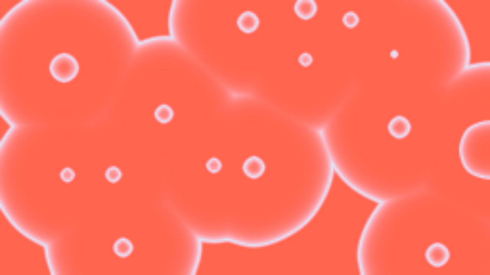

# Honeydew user guide

Honeydew is **a dish of real chemistry on a lightbox, for [Resolume](https://resolume.com)
Arena and Avenue**, as two FFGL plugins in one download: **SW Honeydew**, a source that is the
dish on its lightbox, and **SW Honeydew Over**, an effect whose clip is the lightbox, filtered
through the dish and, where the chemistry is photosensitive, acting on it. Nothing is drawn as a
picture of a reaction. Eight published reactions run in a thin layer, in mol/L and seconds and
millimetres, and the colour of every pixel is the lightbox's light through the layer's
absorption: the red of ferroin and the blue of ferriin, the amber of iodine, the blue-black of
starch–iodine, the purple of permanganate, all fall out of concentrations.



*SW Honeydew at its defaults after 900 chemical seconds (30 seconds at Time-lapse 30×), rendered
by the offline harness rather than captured from Resolume: a 60 mm wide ferroin BZ layer in
Flow, pacemakers firing target waves that annihilate where they meet.*

> **Before you rely on this:** at **v0.1.1**, and honestly early. (0.1.1 adds the
> Excitability control, so Break Wave's spirals are reachable, and a fresh dish stirred hard
> starts on its own; a 0.1.0 composition looks the same.) The chemistry is
> measured rather than asserted, by a harness that drives the real plugin classes headlessly at
> two rasters, and holds the plugin to its own literature. A stirred ferroin dish's period, read
> from the pixels, is 101.19 s against 100.97 s from the three-variable Oregonator integrated in
> double precision; a trigger wave's speed is 0.1017 mm/s against 0.1008 from the one-dimensional
> solution of the same equations, at three acid strengths (at Excitability 0.69, through the
> control); a spiral pair wound from the defaults plus Excitability 0.7, a Drop and Break Wave
> keeps both its cores through 160 of 160 samples, turning every 97 s, and the same press at the
> default leaves none; the iodine clock snaps at 25.25 s
> against the Harcourt–Esson closed form's 25.01; eleven batch Briggs–Rauscher oscillations
> average 248.00 s apart against 248.04 from the De Kepper–Epstein mechanism; the Turing pattern's wavelength, read off the
> state, is 0.122 mm against the Lengyel–Epstein model's 0.1205; every pixel of a uniform dish
> is within 2×10⁻⁷ of a double-precision Beer–Lambert integral through the CIE 1931 observer.
> Twenty deliberately wrong models are each shown to fail their check, one-character mutations
> of the shipped shaders are caught, and all 54 parameters over both plugins are shown to change
> the picture. Eleven of the twenty absorption spectra and some rate constants are stand-ins,
> each named in the chemistry notes. **The chemoconvection cells of a still blue-bottle layer
> are not built**, and Briggs–Rauscher is stirred only.
> It has **never been loaded into Resolume on macOS** — the one host it has run in there is the
> fleet's own test host, `oxbow`, for 120 frames each.
> On Windows both plugins have been loaded: a build of this source loads, registers and renders in Resolume Arena 7.27.1 on software rendering (win-lab, Mesa llvmpipe, no GPU, no sound device), with every control matching what the plugins declare (32 and 35 host controls), Arena's log clean, in the fleet's Arena gate: 15 of 15 checks, the audio rows skipped. Because the dish's waves move every frame, no two grabs of the picture are alike, so the gate could confirm only some controls one at a time: 12 of the source's and 21 of the effect's, the rest inconclusive (none dead). The harness's own sweep (all 54 parameters move the picture) carries the rest. Software rendering says nothing about a GPU or about speed.
> Try it on a spare layer before you put it in a show.
>
> This codebase was created with AI assistance, directed and reviewed by a human author.

---

## Installing

Every download carries both plugins: **SW Honeydew** (a source) and **SW Honeydew Over** (an
effect). Drop them into Resolume's effects folder and restart Resolume:

```
macOS    ~/Documents/Resolume Arena/Extra Effects/
Windows  %USERPROFILE%\Documents\Resolume Arena\Extra Effects\
```

Avenue uses the same layout under its own folder name. SW Honeydew appears among the sources
and SW Honeydew Over in the effects browser.

The macOS download is a universal build (Apple silicon and Intel), as a `.dmg` or a `.zip`. It
is Developer ID-signed and notarised by the release pipeline after publication, so the bundles
simply load; if macOS refuses a download, it predates the signing — download it again. The
Windows download is an x64 installer or a `.zip`. It is not code-signed, so the installer trips
SmartScreen once: **More info** → **Run anyway**.

---

## Real reagents, and everything falls out of them

The dish is a grid of cells, each holding the concentrations of the reaction's species. Every
frame, each cell reacts by the published mechanism at its cited rate constants, and the
species diffuse into their neighbours at their diffusion coefficients, across a dish whose width
is in millimetres. That is all. Nobody draws the rings:

| what you see | why |
| --- | --- |
| **target rings** spreading from points | a speck of dust (a pacemaker) fires early, and each pulse of oxidised catalyst travels out as a trigger wave |
| **cusps where rings meet** | two waves annihilate: each leaves a refractory layer behind it that the other cannot cross |
| **spirals** | with Excitability in the excitable regime the layer is quiet until a drop: Break Wave draws a pipette through a wave and each broken end curls round itself for ever. At the default Excitability the dish oscillates in bulk and the next firing overruns the ends |
| **the whole dish flipping colour at once** | stirred, every cell is at the same point in the oscillation |
| **a sudden snap to blue-black** | the iodine clock: thiosulfate holds the iodine down until it is spent, then the starch complex forms in a moment |
| **spots and stripes that stand still** | the CDIMA Turing pattern: an activator that diffuses slowly and an inhibitor that diffuses fast, at a wavelength the chemistry sets |
| **a colour that comes back when you shake** | the blue-bottle family: air re-oxidises the dye, sugar reduces it again as it stands |
| **rings of purple, green, brown** | a drop of permanganate reduced from its thin edge inwards |

And the colour is the physics, not a palette. Each coloured species has a molar absorption
spectrum; the layer's transmittance is Beer–Lambert through its Depth; the picture is the
lightbox's spectrum through that, seen by the standard observer. So a deeper layer is a darker,
more saturated one, two dyes seen together make the colour they would in a beaker, and the Over
filters your clip the way a real dish on a real lightbox would.

---

## Start here

1. Put **SW Honeydew** in a clip slot and trigger it. A red ferroin layer appears; within a few
   seconds (at Time-lapse 30×, a few minutes of chemistry) pale blue rings spread from the
   pacemakers and meet.
2. Turn **Excitability** up to about 0.7: the dish goes quiet and red (the model stops
   oscillating at f 1.78, the slider's 0.42, at the 1× recipe). Press **Drop**, wait for the ring to reach the middle, then press **Break Wave**. The
   pipette line cuts the ring and each broken end curls into a spiral, which turns for ever.
   (At the default Excitability the dish oscillates in bulk and the next firing overruns the
   cut ends: no spirals.)
3. Turn **Stir** to 1: the dish mixes and the whole layer flips red–blue–red together, once every
   101 seconds of chemistry (about 3.4 s at 30×).
4. Change **Reaction** to *Iodine Clock*. The layer is colourless; it snaps blue-black at 25
   chemical seconds. Press **Drop** (thiosulfate) to clear it and it runs again. Set **Clock
   Sync** to *Bar* and the snaps land on the bar.
5. Change **Reaction** to *Traffic Light* or *Blue Bottle*, and press **Shake** on the beat.
6. For your own footage: put **SW Honeydew Over** on a clip. The clip is the lightbox under the
   dish; with **Catalyst** *Ru(bpy)3* and **Light Coupling** up, the bright parts of the clip
   stop the waves.

---

## The reactions

Time in the dish is chemical time; **Time-lapse** (default 30×) says how much of it passes per
real second. The timescales below are chemical seconds at the 1× recipe.

**Belousov–Zhabotinsky** (the default). Bromate, acid, malonic acid and a catalyst, the
Field–Körös–Noyes mechanism as the three-variable Oregonator. In a still layer, pacemakers fire
target waves that travel at about 0.1 mm/s and annihilate where they meet; stirred, the dish
oscillates as one every 101 s. **Excitability** is the model's stoichiometric factor f (1 to 4):
at the default 1.4 the dish oscillates in bulk; past the model's own boundary (f 1.78 at the
1× recipe, the slider's 0.42; it moves with the acid, 2.16 at twice; the two-variable textbook
value 1 + √2 is not this model's) the rest state is stable, the layer is quiet until a Drop, and
a Break Wave winds a pair of spirals turning every 97 s on the default dish. **Catalyst**
chooses the colour pair and the photosensitivity: *Ferroin* is red (reduced) and blue
(oxidised), the classic; *Ru(bpy)3* is orange and pale green, and light makes bromide in it, so
a lit region is inhibited and waves stop at its edge (the Over's clip, through Light Coupling);
*Cerium* is colourless and yellow. More **Acid or Base** makes faster waves; **Reductant**
(malonic acid) sets the period. In Batch the malonic acid is spent over about an hour of
chemistry and the dish goes quiet; Flow (the default) feeds it for ever.

**Briggs–Rauscher.** Iodate, hydrogen peroxide, malonic acid, manganese, acid and starch,
stirred: **colourless → amber → blue-black** and round again. The plugin runs the De
Kepper–Epstein mechanism, ten species, on the CPU in double precision, and **its period is the
mechanism's, minutes**: in Batch the first cycle takes about two chemical minutes and each one
after takes longer, to about ten, as the reagents run down; in Flow a steady 140 s. That is
not the few seconds of a classroom beaker, so put **Time-lapse** at 100× or more to see it
cycle. In Batch it runs down after eleven cycles (about 40 chemical minutes) and stays
blue-black; Flow keeps it going. It is **stirred only** in
this version: Stir, Drop, Break Wave and the vessel's shape do nothing to it, and it has no
waves.

**Iodine Clock.** Hydrogen peroxide oxidises iodide slowly; thiosulfate turns the iodine straight
back; when the thiosulfate is gone the starch snaps the layer **colourless → blue-black** in a
moment. It is a clock, not an oscillator: at the 1× recipe the snap comes at 25 s, at half the
peroxide 51 s, at twice 12.5 s. The cycle is **dosing**: a **Drop** is a drop of thiosulfate,
which clears the colour and starts the clock again. A Drop at the 1× recipe is small: after the
snap, iodine keeps forming, and filming saw a 3 mm Batch layer not visibly clear. **Clock Sync**
sizes every dose itself, so the next snap lands on the beat or the bar, and it clears every
time.

**CDIMA Turing.** Chlorine dioxide, iodine and malonic acid with starch, as the Lengyel–Epstein
model: the layer settles into **stationary spots and stripes** at a wavelength the chemistry
sets, **0.12 mm** at the 1× recipe, so the pattern only shows at a small Dish Width (10 mm) or
high Detail (1024). It grows slowly: about 160 s per e-folding, so give it 20 chemical minutes
(a Time-lapse of 100× and a few real seconds). Without starch (**Indicator** at 0) there is no
pattern, only a dish oscillating as one. Light suppresses it: through the Over at **Light
Coupling** 1, the bright parts of the clip print into the pattern as blank areas.

**Traffic Light.** Indigo carmine, glucose and sodium hydroxide. Standing, the dye steps down
**green → red → yellow** (the oxidised dye, its one-electron red form, the two-electron yellow
leuco form) over about ten chemical minutes; a **Shake** brings air in and runs it back **yellow
→ red → green** at once. It cycles only because someone keeps shaking it: that is what Shake,
Auto Drop and Audio Shakes are for. The green is really a blue/yellow pair that moves with the
base: at ¼× **Acid or Base** the oxidised dye is blue, at 4× yellow. In Batch the glucose is
spent and each cycle is longer than the last.

**Blue Bottle.** The same chemistry with methylene blue: shaken, **blue**; standing, colourless
again as the glucose reduces it, about 13 chemical minutes at the 1× recipe (twice the air,
twice as long).

**Vanishing Valentine.** The same chemistry with resazurin. The first reduction, blue resazurin
to pink resorufin, is **irreversible**: the layer starts blue, goes pink, and then cycles **pink
⇄ colourless** with every shake, and the blue never comes back.

**Chemical Chameleon.** Potassium permanganate reduced by glucose in strong base: **purple →
green → yellow-brown** (Mn VII → Mn VI → colloidal manganese dioxide), green at 40 s and brown at
64 s after a dose at the 1× recipe, faster with more base. It runs one way, so the cycle is
**dosing**: a **Drop** is permanganate and turns the dish purple again; in a still layer the
drop spreads into rings of the sequence from its thin edge inwards. In Batch the brown colloid
accumulates dose by dose and the layer grows murkier; Flow washes it out. The blue that
demonstrations show between purple and green is not in this plugin: permanganate seen through
manganate reads grey through the measured spectra, and the blue species' chemistry is not
cited well enough to model. **Clock Sync** times each dose so the green lands on the beat or the
bar.

---

## The Reaction group

Resolume shows every slider as 0 to 1; the ranges below are what the ends of each slider mean.

**Reaction** (default *Belousov-Zhabotinsky*). Which chemistry fills the dish. Changing it is a
fresh dish of the new reaction.

**Catalyst** (*Ferroin*, *Ru(bpy)3*, *Cerium*; default *Ferroin*). The BZ catalyst, and with it
the colour pair and whether light acts on the dish. The other reactions ignore it.

**Reactor** (*Batch*, *Flow*; default *Flow*). *Batch* is a dish of reagents that run down: the
BZ's malonic acid is spent, the clock's and the chameleon's doses accumulate what they make, the
dye family's glucose goes. *Flow* is a stirred-tank feed of the recipe (a residence of 300 s;
800 s for Briggs–Rauscher) that keeps every reaction going and washes the products out. Flow is
the default so a dish never goes quiet on stage; Batch is the demonstration.

**Reset** (a button). A fresh dish, with the next set of pacemakers and drop positions.

**Excitability** (f 1 to 4, geometric; default 1.4; BZ only, new in 0.1.1). The Oregonator's
stoichiometric factor. Below the model's boundary (f 1.78 at the 1× recipe, slider 0.42; higher
with more acid) the dish oscillates in bulk, faster at the bottom of the slider; past it the
layer is excitable: quiet and red until a Drop
starts a wave, and a Break Wave winds spirals. The default is the 0.1.0 dish. It is live: turn
it up on an oscillating dish and the oscillation stops after its next cycle.

**Seed** (1 to 9999, default 1). Which pacemakers (BZ) and which random drop positions. The
same Seed always gives the same dish.

## The Recipe group

Four sliders, each a multiplier from ¼× to 4× of the reaction's cited recipe, with the bottom of
the slider meaning none at all. What each is depends on the reaction:

| reaction | Oxidant | Acid or Base | Reductant | Indicator |
| --- | --- | --- | --- | --- |
| Belousov–Zhabotinsky | bromate 0.3 M | acid 0.3 M | malonic acid 0.1 M | the catalyst, 1 mM |
| Briggs–Rauscher | iodate 0.067 M (the peroxide follows it) | acid 0.08 M | malonic acid 0.05 M | starch |
| Iodine clock | hydrogen peroxide 0.1 M | acid 0.05 M | thiosulfate 5 mM | starch |
| CDIMA Turing | chlorine dioxide 2 mM | acid 1 mM | malonic acid 3.5 mM | starch |
| Traffic light, Blue bottle, Vanishing valentine | the air a Shake delivers (saturation) | sodium hydroxide 0.08 M | glucose 0.054 M | indigo carmine, methylene blue or resazurin |
| Chemical chameleon | permanganate per dose, 1.3 mM | sodium hydroxide 0.25 M | glucose 0.05 M | the permanganate in the dish at the start |

**Indicator** at 0 is an empty dish: the lightbox or the clip, unchanged. The 1× molarities and
every constant behind them are in the project's chemistry notes.

## The Vessel group

**Vessel** (*Full Frame*, *Petri Dish*; default *Full Frame*). *Full Frame* fills the picture
with the layer; *Petri Dish* is a round dish with walls nothing crosses, and the lightbox round
it.

**Dish Width** (10 to 300 mm, default 60). The width of the picture, in millimetres. A wave at
0.1 mm/s crosses a 60 mm dish in ten chemical minutes and a 10 mm dish in 100 s; the Turing
pattern's 0.12 mm cells need a small dish.

**Depth** (0.3 to 20 mm, default 1.5). The layer's thickness, which is the colour's path
length: a deeper layer is darker and more saturated, and the dye family wants about 7 mm to
look like the demonstration.

**Stir** (0 to 1, default 0). A stir bar's vortex and its eddies; past 0.6 the whole vessel mixes
to one colour, and at 1 the dish is a stirred beaker (the BZ oscillates as one, the clock snaps
everywhere at once). Stirring also brings in air, so a stirred blue bottle stays blue.

**Time-lapse** (1× to 300×, default 30×). How many chemical seconds pass per real second. Past
a limit the plugin cannot keep up: it runs the chemistry as fast as it can (96 steps a frame)
and drops the rest rather than bursting, and says so in its log. Stirring brings the limit down
a long way: a stirred BZ dish at Detail 256 keeps up only to about 32× (at 60× its stirred
period reads 192 s, not 101), CDIMA on a 10 mm dish to about 200× at Detail 512 and 150× at
1024.

**Detail** (*128*, *256*, *512*, *1024* cells across; default *256*). The grid's resolution. The
grid follows the picture's shape, not its size, so the dish looks the same at any output
resolution. Finer cells cost more and make thinner, slightly slower waves (the front is thinner
than a 0.2 mm cell).

## The Drops group

**Drop** (a button). A drop of the reaction's own reagent: a dab of oxidised catalyst (BZ, which
starts a wave), thiosulfate (the clock), air (the dye family), permanganate (the chameleon).

**Drop Size** (1 to 20 mm, default 4).

**Drop Position** (*Random*, *Centre*; the Over adds *Brightest*: where the clip is brightest).

**Break Wave** (a button). A pipette drawn across the middle third of the dish: it erases every
wave it crosses and leaves the medium refractory, so each broken end curls into a spiral — with
**Excitability** in the excitable regime (0.7 is a good setting). At the default the next bulk
firing overruns the ends. BZ only.

**Shake** (a button). Shakes the dish: a burst of stirring, and air into the dye family. The
traffic light, the blue bottle and the valentine go back to their oxidised colour.

**Auto Drop** (off; 1 to 60 a minute, default off). The reaction's own Drop, by itself (in the
dye family that is a drop of air-saturated water, not a Shake).

**Audio** (Resolume's FFT input). **Audio Drops** and **Audio Shakes** (off by default): a drop or
a shake on every onset in the sound. The first frame after a clip trigger fires nothing, even if
the music is already loud.

## The Clock group

**Clock Sync** (*Off*, *Beat*, *Bar*; default *Off*). Lands a reaction's sharpest transition on
Resolume's beat or bar: the iodine clock's snap, the traffic light's return to yellow, the blue
bottle's and the valentine's fade to colourless, and the chameleon's green. See below.

## The Light group

**Lightbox** (*Daylight D65*, *LED 5000K*, *Warm White*; default *Daylight D65*; the source
only). The light under the dish. D65 is the standard daylight; the two LEDs are a blue pump and a
phosphor band. The Over has no lightbox: its light is the clip.

**Exposure** (−2 to +2 stops, default 0).

The Over only:

**Light Coupling** (0 to 1, default 0.5). How much of the clip's brightness the photosensitive
chemistries see: Ru(bpy)₃ BZ (light inhibits the waves) and CDIMA (light erases the pattern).
At 0 the chemistry does not depend on the clip at all. Ferroin, cerium and the other reactions
ignore it.

**Seed From Clip** (on by default). The bright parts of the clip excite the dish when it is
seeded, so the first waves come from the picture.

**Mix** (0 to 1, default 1). The dish's filtering against the clip. At 0 the clip is returned
exactly, alpha and all.

---

## SW Honeydew Over: your clip is the lightbox

In the Over the clip is the light under the dish. The layer is a filter on it (an empty dish is
exactly no filter), so the clip comes through coloured and darkened the way it would through a
real dish: a BZ layer tints it red and runs blue rings across it, an iodine clock snaps it to
blue-black and clears it, a chameleon floods it purple and lets it fade to brown.

With a photosensitive chemistry the clip also acts on the dish. Under **Catalyst** *Ru(bpy)3*,
light makes bromide, so the bright parts of the clip are inhibited and waves run only through
its dark parts and stop at its bright edges; under *CDIMA Turing* the bright parts erase the
pattern and the dark parts keep it, so a picture prints into the spots and stripes. **Light
Coupling** sets how strongly; **Seed From Clip** starts the first waves where the clip is
bright; **Drop Position** *Brightest* drops where it is brightest.

---

## Clock Sync

Set **Clock Sync** to *Beat* or *Bar* and the plugin uses Resolume's tempo to make each
transition land on the next beat or bar:

- **Iodine Clock**: each thiosulfate dose is sized from the clock's closed form (and what is
  already in the dish) so the snap lands on the boundary. At 120 BPM on the bar, the harness
  measures the snaps within a frame of every bar.
- **Traffic Light, Blue Bottle, Vanishing Valentine**: each shake's air is sized so the fade
  (to yellow, to colourless) lands on the boundary. If no amount of air can land the next
  boundary, the plugin aims for the one after, up to three.
- **Chemical Chameleon**: the green peak comes a fixed time after a dose whatever its size, so
  the dose is timed instead.

After each transition the plugin waits a quarter of the beat or bar before sizing the next, so
the transition is seen. Clock Sync does nothing to BZ, Briggs–Rauscher or CDIMA.

---

## Tips for live use

- **Time-lapse is the main performance control.** At 30× a BZ period is 3.4 s and a wave
  crosses the default dish in 20 s; at 100× the Turing pattern forms in seconds and the
  Briggs–Rauscher cycles every 2.5 s; at 1× nothing visible happens for a minute. Map it to a
  fader.
- **Flow keeps a dish alive; Batch tells a story.** A Batch BZ dish goes quiet in about an hour
  of chemistry (two real minutes at 30×); a Batch valentine spends its glucose and stays pink;
  a Batch chameleon grows murkier with every dose. Press Reset for a fresh one.
- **Shake and Drop on the beat.** Audio Shakes on the blue bottle, Audio Drops on the iodine
  clock or the chameleon, or Clock Sync to put the transition itself on the bar.
- **Light Coupling wants a bright clip.** The dish is a filter, so waves running through a
  clip's black parts cannot be seen at all, and the brightest parts are inhibited. Filming
  found nothing visible on dark clips with bright shapes; on a bright clip, fading Light
  Coupling from 0 up shows the light taking hold. For plain filtering (the dish tinting your
  footage) any clip works; set Light Coupling to 0.
- **Depth is saturation.** Thin layers (0.5 mm) are pale and fast to read; 7 mm is the beaker.
- **The Petri Dish vessel shows the lightbox** round the dish: on the source that is a white (or
  LED) disc on black, which layers well with Add or Alpha.
- **Detail 1024 at 4K costs about 2 ms a frame** on an Apple M4-class GPU, 256 about 1 ms; the
  grid's cost does not depend on the output resolution.

---

## Performance

At Detail 256, on an Apple M4 Max shared with other builds, the median frame is **0.68 ms at
720p, 0.7–0.8 at 1080p and 1.1–1.3 at 4K** for SW Honeydew, and **0.68, 0.85 and 1.47 ms** for SW
Honeydew Over; Briggs–Rauscher (on the CPU) 0.9–1.3 ms; the blue bottle 0.5–0.9 ms; BZ at Detail
1024 1.5–2.0 ms. That is 3–12% of a 60 fps frame.

---

## If it looks wrong

**The dish is a flat colour and nothing happens.** Time-lapse is low, or the reaction is slow
at this recipe (Briggs–Rauscher needs minutes of chemistry per cycle: raise Time-lapse). Press
Drop to start a wave or a cycle.

**The BZ dish went quiet.** Batch: the malonic acid is spent. Reset, or switch to Flow.

**Break Wave made no spirals.** Excitability is at its default, where the dish oscillates in
bulk and overruns the cut ends. Turn it up to about 0.7, press Drop,
wait for the ring to reach the middle of the dish, then press Break Wave.

**The excitable dish is quiet and red.** That is what excitable means: nothing happens until a
Drop (or Auto Drop, or Audio Drops) starts a wave. Turn Excitability down for a dish that
oscillates on its own.

**No Turing pattern.** The wavelength is 0.12 mm: set Dish Width to 10 mm or Detail to 1024,
give it twenty chemical minutes, and keep Indicator above 0 (no starch, no pattern).

**The blue bottle stays blue.** It is stirred (Stir brings air in), or Flow is feeding oxygen:
set Stir to 0, **Reactor** to *Batch*, and let it stand. The valentine is the same.

**The valentine never goes blue.** It only is before the first fade; after that it is pink and
colourless. Press Reset for a fresh blue dish.

**Clock Sync is not landing on the bar.** The reaction is one Clock Sync does not act on (BZ,
Briggs–Rauscher, CDIMA), Resolume's tempo is not reaching the plugin, or the recipe is so slow
that no dose can land the next bar (the plugin then aims for a later one).

**The Over shows my clip unchanged.** Indicator is at 0 (an empty dish), or Mix is at 0.

**The Over's waves never start.** The clip is bright everywhere under Ru(bpy)₃: lower Light
Coupling, or use Ferroin, which ignores the light.

**It is slow.** Detail 1024 with Time-lapse at 300× on a busy reaction: lower one of them. The
log says when the plugin is dropping chemical time.

**Neither plugin is in the browser.** Check the folder under Installing, and that Resolume was
restarted.

**It does nothing at all.** A shader that will not compile looks exactly like that, and the
real message is in the log:

```
macOS    ~/Library/Logs/honeydew/honeydew.YYYY-MM-DD.log
Windows  %LOCALAPPDATA%\honeydew\logs\honeydew.YYYY-MM-DD.log
```

It records the GL vendor, renderer and version at load, which shader failed if one did, and
when the chemistry could not keep up with Time-lapse.

---

## Not in 0.1.0

- **Chemoconvection.** A still blue-bottle layer in a real dish forms convection cells
  (oxygen enters at the top, the oxidised layer is denser and sinks). The depth-resolved
  solver for it is not built, and there is no Convection control; a still layer takes oxygen
  through its surface by a simple closure instead.
- **Briggs–Rauscher is stirred only.** No waves, no drops, no vessel shape.
- **The chameleon has no blue.** Permanganate seen through manganate reads grey through the
  measured spectra; the blue species (hypomanganate) is not modelled.
- **Resorufin's fluorescence**, CO₂ bubbles in BZ, temperature, the settling of the
  chameleon's colloid.
- **No OpenFX version, no browser demo, no presets.**

## Known limits

- **Spirals need Excitability past 0.42 (f 1.78 at the 1× recipe) and a Drop first.** At the
  default (the 0.1.0 dish)
  Break Wave makes none: the dish oscillates in bulk and overruns the cut ends.
- **The plugin is held to the cited models, not to a dish.** Eleven of the twenty absorption
  spectra and a number of rate and diffusion constants are stand-ins, each marked in the
  chemistry notes; the pacemakers, the stirring, the aeration and the Flow residence are models
  with a stated form.
- **Briggs–Rauscher's period is the mechanism's**, minutes, not a demonstration's seconds.
- **There is a browser demo** at [honeydew-demo.stoatworks-labs.com](https://honeydew-demo.stoatworks-labs.com/).
  It runs the plugin's own code, compiled to WebAssembly, and its own shaders in WebGL2, so it
  behaves as the plugin does; it has no tempo from a host and no audio, and the page lists what
  else differs.
- **Briggs–Rauscher in a Petri Dish** shows its 32-column CPU grid as a staircase at the rim.
- **Past 96 chemistry steps a frame** (Time-lapse 300× on BZ at Detail 1024) the chemistry runs
  slower than Time-lapse says, counted and logged, never banked.
- **Wave speed is 18% faster at 0.2 mm cells** (Detail 256 on a 60 mm dish) than at 0.1 mm:
  the front is thinner than a cell, and the reference does the same.
- **Never loaded into Resolume on macOS.** Everything numeric was compiled, rendered and
  measured offline against the real plugin classes in a headless GL context, plus an `oxbow`
  load. No real audio has reached it in a host: the audio controls were checked with a
  synthetic spectrum only.
- **Only ever run on an Apple M4 Max**, although the macOS build contains an Intel slice. On
  Windows, see the note at the top of this guide.

---

## About

The last group, **About**, carries the plugins' name, version, licence and maker, and buttons
that open this user guide, the project page, the source on GitHub and the support page in your
browser.
